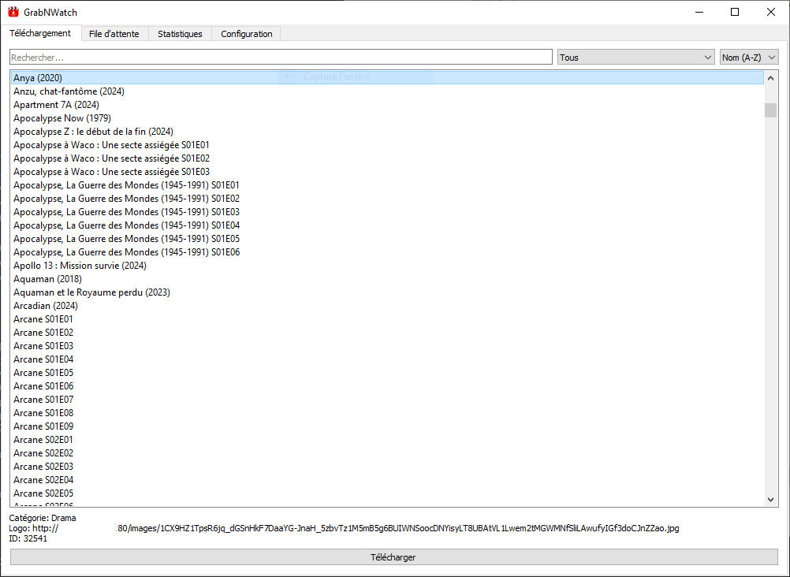
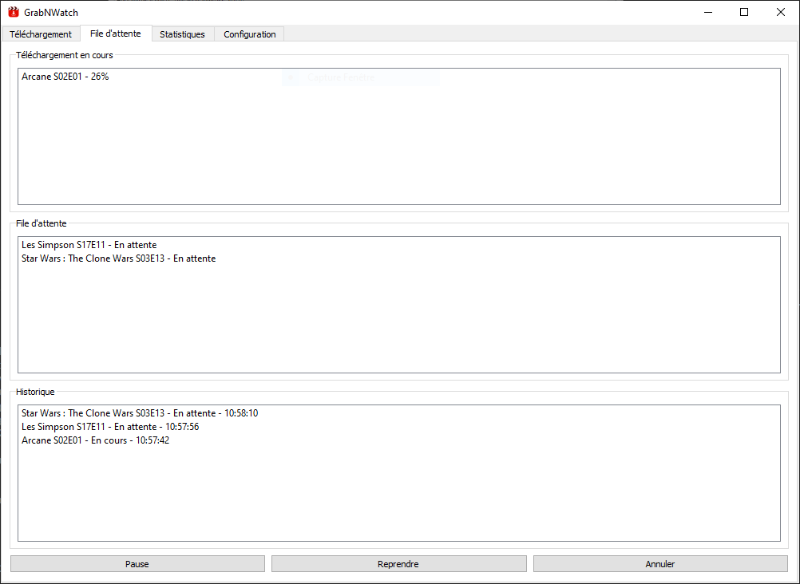
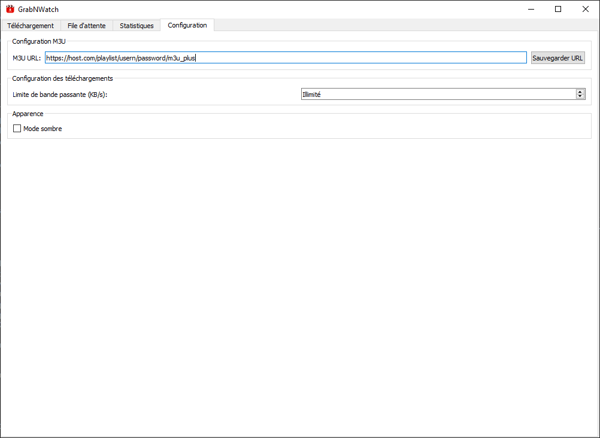

# GrabNWatch 📺

GrabNWatch est une application de bureau qui permet de télécharger des vidéos à partir d'une URL au format .m3u (M3U Plus - MPEGTS).



## ✨ Fonctionnalités

- 🎥 Téléchargement de vidéos depuis une URL m3u
- 📋 Gestion intégrée de la file d'attente
- 📝 Connexion automatique à la playlist m3u
- ⚙️ Configuration personnalisable
- 📊 Statistiques de téléchargement
- 📂 Choix du dossier de destination pour les téléchargements
- 🔄 Vérification des mises à jour directement depuis l'application

## 📸 Captures d'écran

### Téléchargement et file d'attente

*Interface principale avec la liste des vidéos et la file d'attente intégrée*

### Configuration

*Paramètres de l'application*

## 🚀 Installation

1. Téléchargez la dernière version depuis la [page des releases](https://github.com/watpow/GrabNWatch/releases)
2. Exécutez le fichier `GrabNWatch.exe`
3. C'est tout ! Aucune installation supplémentaire n'est nécessaire

## 🛠️ Pour les développeurs

### Prérequis
- Python 3.8 ou supérieur
- pip (gestionnaire de paquets Python)

### Installation des dépendances
```bash
pip install -r requirements.txt
```

## Utilisation

1. Lancer l'application :
```bash
python src/main.py
```

2. Dans l'onglet "Configuration", entrer l'URL de votre playlist M3U et cliquer sur "Sauvegarder URL"

3. Dans l'onglet "Téléchargement" :
   - Rechercher des VODs par nom
   - Filtrer par catégorie
   - Sélectionner un VOD et cliquer sur "Télécharger"

4. Dans l'onglet "File d'attente" :
   - Voir les téléchargements en cours et en attente
   - Mettre en pause/reprendre les téléchargements
   - Annuler les téléchargements
   - Voir l'historique des téléchargements

## Build

Pour créer un exécutable Windows :

Option 1 - Utiliser le script de build (recommandé) :
```bash
python build.py
```

L'exécutable sera créé dans le dossier `dist` sous le nom `GrabNWatch.exe`.

## Structure du projet

```
GrabNWatch/
├── src/
│   ├── assets/         # Ressources (icônes, etc.)
│   ├── core/           # Fonctionnalités principales
│   │   ├── download.py # Gestion des téléchargements
│   │   ├── config.py   # Gestion de la configuration
│   │   └── m3u.py      # Parsing M3U
│   ├── ui/            # Interface utilisateur
│   │   ├── main_window.py
│   │   ├── download_tab.py
│   │   ├── queue_tab.py
│   │   ├── stats_tab.py
│   │   └── config_tab.py
│   └── main.py        # Point d'entrée
├── requirements.txt
└── README.md
```

## Configuration

La configuration est sauvegardée dans `config.json` situé dans le dossier `AppData` et comprend :
- URL de la playlist M3U
- Limite de bande passante (KB/s, 0 = illimité)
- Mode sombre
- Dossier de téléchargement
- Statistiques de téléchargement

## Remarques importantes

- Les téléchargements sont limités à un à la fois pour éviter la surcharge
- Les autres téléchargements sont automatiquement mis en file d'attente
- Veuillez vous assurer de ne pas avoir de flux IPTV actifs sur d'autres appareils lors de l'utilisation de GrabNWatch, sauf si vous disposez de plusieurs lignes
